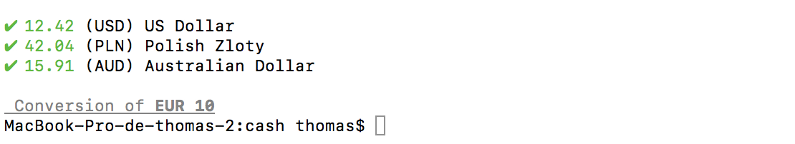

# cash

Module wich allow us to convert one currency to an other one.


### Installing

Install dependencies

```
npm install
```

## Usage

```
node index.js [amount] [fromCurrencie] [toCurrencies]
```

You can find the list of currencies here :

* [Currencies](http://akep.us/currencies)


## Built With

* [Money](https://www.npmjs.com/package/money) - Money
